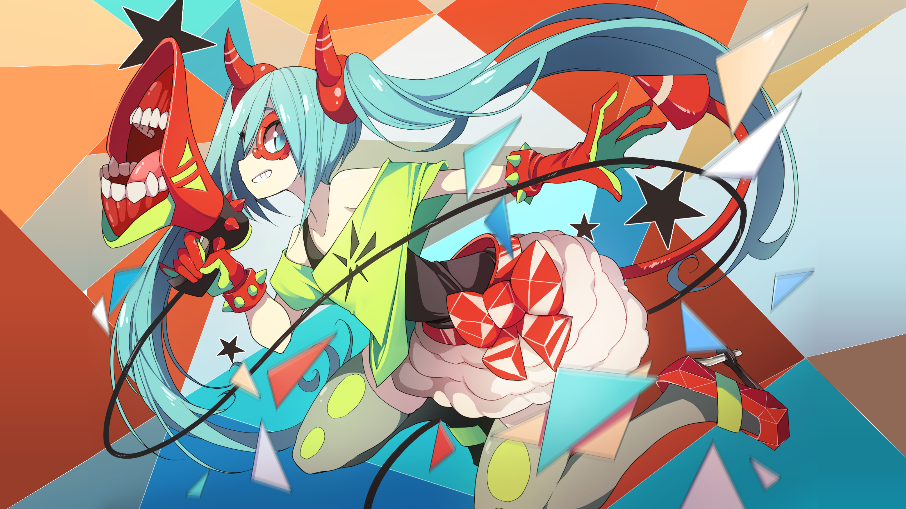

<h1 align="center">
  <br>
  🌊 Miku × Tokyo Night — Arch Linux Hyprland & Quickshell Dotfiles
  <br>
</h1>

<p align="center">
  <b>A meticulously crafted, Hatsune Miku–inspired Wayland desktop environment built on Hyprland, Quickshell, and the Tokyo Night color palette.</b>
</p>

<p align="center">
  <a href="#-quick-start"></a>
  <a href="#-components"></a>
  <a href="#-components"></a>
  <a href="#-color-palette"></a>
</p>

---

## 🖼️ Wallpaper



---

## 📑 Table of Contents

- [Quick Start](#-quick-start)
- [Single Source of Truth & Theme Tokens](#-single-source-of-truth--theme-tokens)
- [Color Palette](#-color-palette)
- [Typography](#-typography)
- [Icon Hierarchy](#-icon-hierarchy)
- [Components](#-components)
  - [Hyprland (Compositor)](#hyprland-compositor)
  - [Quickshell (Status Bar, Launcher, Overlays)](#quickshell-status-bar-launcher-overlays)
  - [Hyprlock & Hypridle (Lock & Power Management)](#hyprlock--hypridle)
  - [Kitty (Terminal)](#kitty-terminal)
  - [Ly (Login Screen)](#ly-login-screen)
  - [Wlogout (Logout Menu)](#wlogout-logout-menu)
  - [Btop (System Monitor)](#btop-system-monitor)
  - [Starship (Shell Prompt)](#starship-shell-prompt)
  - [GTK 3 & GTK 4 Theming](#gtk-theming)
  - [Qt 5 & Qt 6 Theming](#qt-theming)
  - [Fontconfig (Font Fallback Chain)](#fontconfig-browser-fonts)
  - [Thunar Custom Actions](#thunar-custom-actions)
- [Custom Scripts](#-custom-scripts)
- [Keybindings](#-keybindings)
- [Directory Structure](#-directory-structure)
- [Credits](#-credits)

---

## 🚀 Quick Start

```bash
# Clone the repository
git clone https://github.com/sea-deep/arch-theme.git ~/code/arch-theme
cd ~/code/arch-theme

# Run the installer (do NOT run as root)
chmod +x install.sh
./install.sh
```

The installer will:
1. Configure Pacman parallel downloads, enable the `multilib` repository, and set up `chaotic-aur`.
2. Install `yay` (AUR helper) if missing.
3. Install all required packages via `yay` (Hyprland, Quickshell, Ly, Kitty, Thunar, Qt/GTK engines).
4. Back up any existing configs to `*.bak`.
5. Symlink configurations from this repo into `~/.config/` and `~/.local/share/`.
6. Run `scripts/sync-theme.sh` to compile all Qt, GTK, and KDE palettes from `theme/tokens.json`.
7. Configure Ly display manager and TTY color service.
8. Optionally configure fingerprint authentication and TLP power management.

---

## 💎 Single Source of Truth & Theme Tokens

All design tokens across colors, typography, geometry metrics, icon inheritance, wallpaper, and platform environment defaults are centrally defined in:

- **Tokens Definition:** [`theme/tokens.json`](theme/tokens.json)
- **Synchronizer Script:** [`scripts/sync-theme.sh`](scripts/sync-theme.sh)

Whenever you adjust a color, font, or metric in `theme/tokens.json`, run:

```bash
./scripts/sync-theme.sh
```

This single command automatically regenerates and updates:
- **Qt5 & Qt6:** 21-role `TokyoNight.conf` color schemes in `qt5ct/colors/` and `qt6ct/colors/`.
- **GTK3 & GTK4:** `colors.css` and `settings.ini` variables.
- **KDE / Polkit:** Tokyo Night RGB definitions in `kdeglobals`.
- **Kvantum:** `Kvantum-Tokyo-Night.kvconfig` general colors.
- **XSettings:** `xsettingsd/xsettingsd.conf`.
- **User Symlinks:** Re-links all palettes into `~/.local/share/qt5ct/` and `~/.local/share/qt6ct/`.

---

## 🎨 Color Palette

The desktop color scheme is derived from **Tokyo Night** with **Hatsune Miku Teal** accents:

| Role | Hex | RGB | Purpose |
|------|-----|-----|---------|
| **Base Background (`bg`)** | `#1a1b26` | `26, 27, 38` | Main window, panel backgrounds, terminal bg |
| **Deep Background (`bgDark`)** | `#16161e` | `22, 22, 30` | Base text inputs, inactive surfaces, borders |
| **Light Surface (`bgLight`)** | `#24283b` | `36, 40, 59` | Buttons, cards, popover surfaces |
| **Muted Surface (`surface`)** | `#2f3549` | `47, 53, 73` | Dividers, mid-level surface containers |
| **Surface Variant (`surfaceVariant`)** | `#3b4261` | `59, 66, 97` | Subtle borders, elevated card highlights |
| **Foreground (`fg`)** | `#c0caf5` | `192, 202, 245` | Primary text and sharp iconography |
| **Dim Foreground (`fgDim`)** | `#9aa5ce` | `154, 165, 206` | Secondary labels and inactive text |
| **Muted Foreground (`fgMuted`)** | `#565f89` | `86, 95, 137` | Placeholders, disabled states, comments |
| **Miku Teal (`accent`)** | `#39c5bb` | `57, 197, 187` | Focused borders, active pills, primary accents |
| **Teal Glow (`accentGlow`)** | `#33e0e0` | `51, 224, 224` | Hover states, glowing boundary effects |
| **Miku Pink (`mikuPink`)** | `#e35885` | `227, 88, 133` | Special badges, media playback accents |
| **Miku Dark (`mikuDark`)** | `#134c48` | `19, 76, 72` | Subtle inactive teal fills |
| **Blue (`blue`)** | `#7aa2f7` | `122, 162, 247` | Hyperlinks and informational widgets |
| **Purple (`purple`)** | `#bb9af7` | `187, 154, 247` | Media progress, secondary highlight |
| **Red (`red`)** | `#f7768e` | `247, 118, 142` | Errors, close buttons, battery critical |
| **Yellow (`yellow`)** | `#e0af68` | `224, 175, 104` | Warnings, notifications |
| **Green (`green`)** | `#73daca` | `115, 218, 202` | Success indicators, battery full |

---

## ✏️ Typography

The desktop standardizes strictly on two typefaces:

| Context | Font | Weight | Weight Token | Where Applied |
|---------|------|--------|--------------|---------------|
| **System UI & Documents** | IBM Plex Sans | SemiBold (600) | `63` | Hyprland, Quickshell, GTK 3/4, Qt 5/6, KDE |
| **Monospace & Code** | FiraCode Nerd Font | SemiBold (600) | `63` | Kitty, Starship, Quickshell status clock |

---

## 🎭 Icon Hierarchy

A two-tiered icon inheritance hierarchy provides clean minimalism for application browsing alongside rich iconography inside applications:

1. **Top Tier — App Launcher & Workspaces (`YAMIS-enlarged`):**
   - Pure flat monochromatic SVG icons for applications (`icons/YAMIS-enlarged/apps/`).
   - Non-app directories are pruned from YAMIS so they never conflict with in-app UI.
2. **Inherited Tier — In-App UI, Toolbars & Places (`TokyoNight-SE`):**
   - File actions, save icons, folder glyphs, and status indicators automatically fall through to `TokyoNight-SE`, `breeze-dark`, and `hicolor`.

---

## 🧩 Components

### Hyprland (Compositor)

**Config:** [`hypr/hyprland.lua`](hypr/hyprland.lua)

- Native Lua-based configuration (`hyprland.lua`).
- Dynamic 1080p fractional scale cycling bound to <kbd>Super + =</kbd>.
- Hardware screen shaders with alternating cache fix (`comfort`, `grayscale`, `vivid`).
- Enforced `:close` window decoration button layout preventing Electron/Chromium minimization suspension bugs.

---

### Quickshell (Status Bar, Launcher, Overlays)

**Root:** [`quickshell/shell.qml`](quickshell/shell.qml) · **Bar:** [`quickshell/Bar.qml`](quickshell/Bar.qml)

Quickshell implements the entire interactive shell:
- **Full-Width Fluid Bar:** Zero-gap edge-to-edge status bar with concave corner fillets.
- **Native App Launcher (`Launcher.qml`):** Instant search, pinned apps, recently opened tracking, and smooth gliding unroll.
- **Clipboard Manager (`ClipboardPicker.qml`):** Standalone cursor-following popup with Wayland Drag-and-Drop support and auto-paste simulation.
- **Emoji Picker (`EmojiPicker.qml`):** Native categorised picker with search.
- **Quick Controls (`QuickControls.qml`):** Master audio, application streams, brightness, and screen shaders with hover-wheel volume control.
- **System Tray (`TrayExpander.qml`):** StatusNotifier DBus tray with reactive hot-reload synchronization.

---

### Hyprlock & Hypridle

**Lockscreen:** [`hypr/hyprlock.conf`](hypr/hyprlock.conf) · **Idle:** [`hypr/hypridle.conf`](hypr/hypridle.conf)

- Uses canonical crisp wallpaper (`satisfaction_hires.png`).
- Seamless fingerprint and password unlock.
- Non-poisoning brightness persistence: restores hardware backlight upon resume.

---

### Kitty (Terminal)

**Config:** [`kitty/kitty.conf`](kitty/kitty.conf)

- Tokyo Night colors with Miku Teal cursor.
- 95% opacity with crisp text rendering.
- `FiraCode Nerd Font` 13pt.

---

### Ly (Login Screen)

**Config:** [`ly/config.ini`](ly/config.ini) · **TTY Theme:** [`ly/set-tty-theme.sh`](ly/set-tty-theme.sh)

- Elegant, lightweight TUI display manager.
- Automated systemd one-shot service sets the 16-color Linux VT palette to Tokyo Night before login.

---

### Wlogout (Logout Menu)

**Layout:** [`wlogout/layout`](wlogout/layout) · **Style:** [`wlogout/style.css`](wlogout/style.css)

- Fullscreen power overlay for lock, suspend, logout, reboot, and shutdown.

---

### Btop (System Monitor)

**Config:** [`btop/btop.conf`](btop/btop.conf) · **Theme:** [`btop/themes/miku-dark.theme`](btop/themes/miku-dark.theme)

- Launched via <kbd>Super + Escape</kbd>.

---

### Starship (Shell Prompt)

**Config:** [`starship.toml`](starship.toml)

- Powerline pill prompt in Zsh showing user, directory, git status, and execution state.

---

### GTK Theming

**Config:** [`gtk-3.0/`](gtk-3.0/) · [`gtk-4.0/`](gtk-4.0/)

- Base theme: `adw-gtk3-dark`.
- Dynamic color variables generated from `theme/tokens.json`.
- Icon theme: `YAMIS-enlarged`.

---

### Qt Theming

**Config:** [`qt5ct/`](qt5ct/) · [`qt6ct/`](qt6ct/) · [`Kvantum/`](Kvantum/) · [`kdeglobals`](kdeglobals)

- Complete 21-role Tokyo Night palette for Qt 5 and Qt 6.
- `Kvantum-Tokyo-Night` SVG widget theme with teal accents.
- `QT_WAYLAND_DISABLE_WINDOWDECORATION="1"` disables conflicting client-side borders.
- Unified `QT_QPA_PLATFORMTHEME="qt5ct"` seamlessly loads `libqt5ct.so` for Qt5 and `libqt6ct.so` for Qt6.

---

### Thunar Custom Actions

**Config:** [`Thunar/uca.xml`](Thunar/uca.xml)

1. **Copy Path:** Copies exact file/directory path to Wayland clipboard (`wl-copy -n "%f"`).
2. **Set as Wallpaper:** Instantly applies image as wallpaper via `swww`.
3. **Open Terminal Here:** Opens Kitty at the current directory.
4. **Open as Root:** Opens elevated Thunar window.
5. **Open with VSCode:** Opens file or directory in VS Code.

---

## ⌨️ Keybindings

All keybindings use `Super` (Windows key) as the main modifier:

### Applications
| Keys | Action |
|------|--------|
| `Super + Return` | Terminal (Kitty) |
| `Super + Space` | Native App Launcher (Quickshell) |
| `Super + V` | Native Clipboard Manager (Quickshell) |
| `Super + .` | Native Emoji Picker (Quickshell) |
| `Super + B` | Web Browser (Zen Browser) |
| `Super + E` | File Manager (Thunar) |
| `Super + Z` | Code Editor (Zed) |
| `Super + Escape` | System Monitor (Btop) |

### Window Management & Workspaces
| Keys | Action |
|------|--------|
| `Super + Q` | Close window |
| `Super + F` | Toggle fullscreen |
| `Super + Shift + Space` | Toggle floating |
| `Super + H/J/K/L` | Move focus (Vim keys) |
| `Super + Shift + H/J/K/L` | Move window (Vim keys) |
| `Super + 1–0` | Switch to workspace 1–10 |
| `Super + Shift + 1–0` | Move window to workspace 1–10 |
| `Super + =` | Cycle display fractional scale (1.0 → 1.2 → 1.25 → 1.5) |

### Media & Hardware
| Keys | Action |
|------|--------|
| `XF86AudioMute` | Toggle mute |
| `XF86AudioLowerVolume` / `RaiseVolume` | Volume ±5% |
| `XF86AudioMicMute` | Toggle microphone |
| `XF86AudioPlay` / `Next` / `Prev` | Media controls |
| `XF86MonBrightnessDown` / `Up` | Brightness ±5% |
| `Super + Shift + S` | Region screenshot → Swappy |
| `Super + Print` | Fullscreen screenshot to clipboard |

### System & Compositor
| Keys | Action |
|------|--------|
| `Super + Shift + C` | Hot reload desktop (Hyprland, Quickshell & screen shaders) |
| `Super + Shift + E` | Logout overlay (Wlogout) |

---

## 📁 Directory Structure

```
arch-theme/
├── ⚙️ theme/                     # Single source of truth
│   └── tokens.json              #   Unified design tokens
│
├── 🪟 hypr/                      # Hyprland compositor configuration
│   ├── hyprland.lua             #   Main Hyprland Lua config
│   ├── hypridle.conf            #   Idle inhibitor & sleep daemon
│   ├── hyprlock.conf            #   Lockscreen configuration
│   ├── screenshot.sh            #   Quickshell IPC screenshot helper
│   └── scripts/                 #   Compositor helper utilities
│
├── 🐚 quickshell/                # Quickshell desktop shell
│   ├── shell.qml                #   ShellRoot & IPC dispatcher
│   ├── Bar.qml                  #   Fluid top status bar
│   ├── launcher/                #   Native app launcher
│   ├── clipboard/               #   Cursor-following clipboard overlay
│   ├── emoji/                   #   Native emoji picker
│   ├── controls/                #   Drop-down expanders (QuickControls, Tray, etc.)
│   ├── bar/                     #   Bar modules (Clock, Audio, Battery, Workspaces)
│   ├── theme/                   #   Theme.qml & UiState.qml
│   └── scripts/                 #   Brightness, power profile, shader scripts
│
├── 🐱 kitty/                     # Terminal emulator
│   └── kitty.conf               #   Colors, font, opacity
│
├── 🎨 gtk-3.0/ & gtk-4.0/        # GTK theming
│   ├── colors.css               #   Compiled Tokyo Night color variables
│   ├── gtk.css                  #   Custom widget styles
│   └── settings.ini             #   Theme, icon, font configuration
│
├── ⚙️ qt5ct/ & qt6ct/            # Qt 5 and Qt 6 configuration
│   ├── qt5ct.conf / qt6ct.conf  #   Active palette and proxy settings
│   └── colors/TokyoNight.conf   #   21-role Tokyo Night color scheme
│
├── 🎨 Kvantum/                   # Kvantum SVG widget themes
│   ├── kvantum.kvconfig         #   Theme selection
│   └── Kvantum-Tokyo-Night/     #   Tokyo Night Kvantum theme
│
├── 📁 Thunar/                    # File manager custom actions
│   └── uca.xml                  #   Copy Path, Set as Wallpaper, etc.
│
├── 🖼️ icons/                     # Icon themes
│   └── YAMIS-enlarged/          #   Flat app icons inheriting TokyoNight-SE
│
├── 🔑 ly/                        # Display manager
│   ├── config.ini               #   Ly TUI theme configuration
│   └── set-tty-theme.sh         #   16-color TTY scheme injector
│
├── 🚪 wlogout/                   # Logout overlay
├── 📈 btop/                      # System monitor
├── 🔤 fontconfig/                # Font fallback configuration
├── 🧰 environment.d/             # Wayland & Qt session environment variables
├── 📜 scripts/                   # Theme sync & system hooks
│   └── sync-theme.sh            #   Compiles all configs from tokens.json
├── 🌌 wallpapers/                # Canonical high-resolution wallpaper
└── 📦 install.sh                 # Unified installation & setup script
```

---

## 🙏 Credits

- **Design System:** [Tokyo Night](https://github.com/enkia/tokyo-night-vscode-theme) by enkia, accented with Hatsune Miku Teal.
- **Icons:** [YAMIS](https://github.com/dirn/yamis) by dirn & [TokyoNight-SE](https://github.com/ljmill/tokyo-night-icons).
- **GTK Theme:** [adw-gtk3](https://github.com/lassekongo83/adw-gtk3).
- **Cursor Theme:** [Breeze](https://github.com/KDE/breeze).
- **Wallpaper Art:** Hatsune Miku "Satisfaction" illustration.

---

<p align="center">
  <sub>Maintained with 💙 by <a href="https://github.com/sea-deep">@sea-deep</a></sub>
</p>
